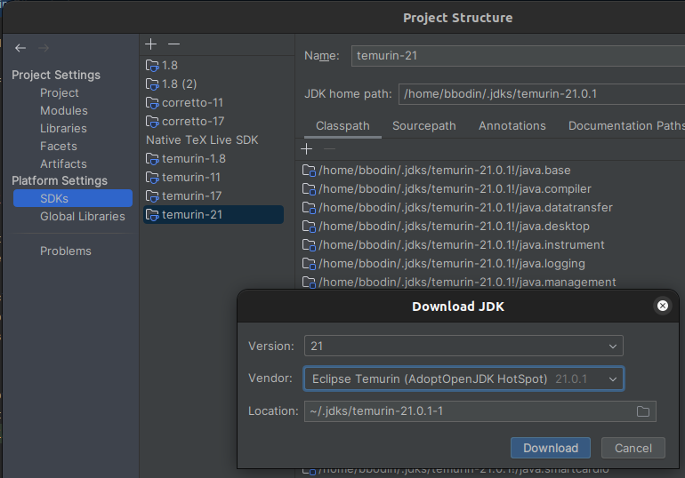
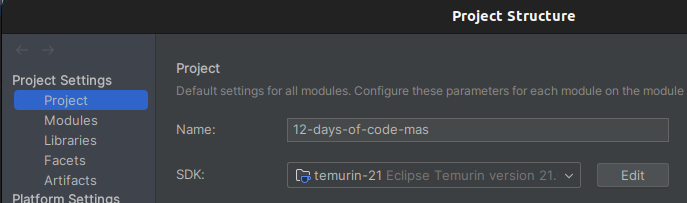
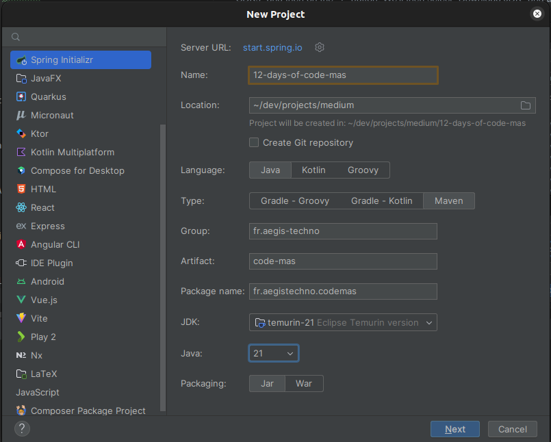

# Day 1: One Partridge in a Pear Tree (Environment Setup)

Welcome to the inaugural day of our "12 Days of Code-mas" adventure! Today's mission is all about crafting the perfect development environment, a crucial foundation for our Holiday Countdown App. Think of it as preparing your digital workshop for a season of festive coding.

## Assembling Our Development Toolkit

Our journey into building a festive web application requires a toolkit that's as diverse as it is powerful. Working with Angular and Spring Boot, our digital toolbox will include:

- **Node.js**: We'll be harnessing Node.js for server-side JavaScript execution. Utilizing `nvm` (Node Version Manager), we'll manage multiple Node.js versions, specifically using version 20.9.0.
- **Yarn**: Chosen for its speed and security, Yarn will be our package manager, an alternative to npm.
- **Angular CLI**: Essential for Angular project management, we'll be using Angular CLI version 17.0.0 to access the latest features.
- **Java**: The programming language backbone for our Spring Boot backend, where we'll use version 21.0.0 of Java, specifically opting for the Temurin JDK for its performance benefits.
- **Spring Boot**: We'll leverage Spring Boot version 3.1.5, renowned for its capability to build stand-alone, production-grade Spring applications with minimal fuss.
- **IntelliJ IDEA**: This powerful IDE supports both Angular and Spring Boot development. We'll use IntelliJ IDEA (Community Edition available) for an enriched coding experience.

## Crafting Your Development Environment

### Step 1: Setting Up IntelliJ IDEA

Start by downloading IntelliJ IDEA from [JetBrains](https://www.jetbrains.com/idea/download/). Once downloaded, install it using:

```bash
sudo tar -xzf ideaIU-2023.2.5.tar.gz -C /opt
```

Launch IntelliJ IDEA with:

```bash
/opt/idea-IU-232.10227.8/bin/idea.sh
```

For detailed installation guidance, refer to [IntelliJ's Installation Guide](https://www.jetbrains.com/help/idea/installation-guide.html).

### Step 2: Installing Java Development Kit (JDK) - Temurin

To install the Temurin JDK, we'll use the interface of IntelliJ IDEA. To do this, we'll open IntelliJ IDEA in the project directory.

Within IntelliJ IDEA, navigate to "File" > "Project Structure". Under "SDKs", add a new SDK by selecting "Download JDK", choosing version "21", vendor "Temurin", and proceeding with the download.


Once downloaded, select the newly downloaded SDK in your project settings and click "Apply" and "OK".


For more details, visit [Temurin JDK Installation](https://adoptium.net/installation.html).

### Step 3: Setting Up Spring Boot

Open IntelliJ IDEA and select "File" > "New" > "Project". Choose "Spring Initializr", select "Maven" as the build tool, "Java" as the language, JDK "21", and proceed. Add "Lombok", "Spring Web", and "Spring Data JPA" as dependencies and continue.


For additional information, check out [Spring Boot Installation](https://spring.io/guides/gs/spring-boot/).

### Step 4: Installing Git

Install Git using:

```bash
sudo apt install git
```

Verify the installation with `git --version`, and initialize a Git repository in your project directory with `git init`.

Further details on Git installation are available [here](https://git-scm.com/book/en/v2/Getting-Started-Installing-Git).

### Step 5: Installing Node.js with NVM

To install Node.js, we'll use a version manager called nvm. This allows us to install and manage multiple versions of
Node.js on the same system. 


Install nvm with:

```bash
curl -o- https://raw.githubusercontent.com/nvm-sh/nvm/v0.39.5/install.sh | bash
```

For more on `nvm`, visit its [GitHub page](https://github.com/nvm-sh/nvm#installing-and-updating).

Then install Node.js version 20.9.0 using nvm:

```bash
nvm install 20.9.0
```

Set this version for your project by creating a `.nvmrc` file with `echo 20.9.0 > .nvmrc` and activate it with `nvm use`.

Node.js installation details are available at [Node.js](https://nodejs.org/en/download/).

### Step 6: Installing Yarn

Install Yarn globally with:

```bash
npm install -g yarn
```

Confirm the installation with `yarn -v`. More information can be found on [Yarn's Installation Guide](https://classic.yarnpkg.com/en/docs/install).

### Step 7: Installing Angular CLI

Install Angular CLI globally via Yarn:

```bash
yarn global add @angular/cli
```

Verify the installation with `ng version`. For more details, visit [Angular CLI Documentation](https://angular.io/cli).

## Troubleshooting Common Issues

When setting up your development environment for the "12 Days of Code-mas" project, you might encounter a few hurdles. This section aims to address common issues and provide solutions to ensure a smooth setup process.

### Node.js and Yarn Installation Issues

Problem: Node.js or Yarn not recognized in the terminal after installation.

Solution: This is usually a PATH issue. Ensure that Node.js and Yarn are correctly added to your system's PATH environment variable. Restarting your computer or terminal session can also help.

### Angular CLI Installation Problems

Problem: ng commands not recognized after installing Angular CLI.

Solution: Similar to Node.js/Yarn, this is often a PATH issue. Check if the Angular CLI is properly installed globally and that its installation path is added to the system's PATH. Sometimes, simply reopening the terminal or IDE can resolve the issue.
JDK (Temurin) Setup in IntelliJ IDEA

Problem: The IDE doesn't recognize the JDK after installation.

Solution: Check the project structure settings in IntelliJ IDEA (File > Project Structure) and ensure that the JDK path is correctly set under the SDKs section.

### General IDE Issues

Problem: IntelliJ IDEA is running slow or crashes frequently.

Solution: Check if your system meets the IDE's hardware requirements. Increasing the allocated memory to the IDE can also help (adjustable in Help > Edit Custom VM Options). Additionally, disable any unnecessary plugins to improve performance.

### Final Notes

If you encounter a problem not listed here, don't hesitate to seek help from online communities like Stack Overflow or the respective tool's official support channels. Remember, troubleshooting is an integral part of the developer's journey and a valuable learning experience in itself.

## Wrapping Up and Looking Forward

With your development environment set up, you're now ready to start coding! This foundational step is crucial for a seamless development experience in the subsequent chapters of our holiday coding adventure.
